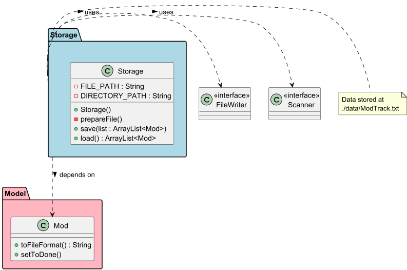
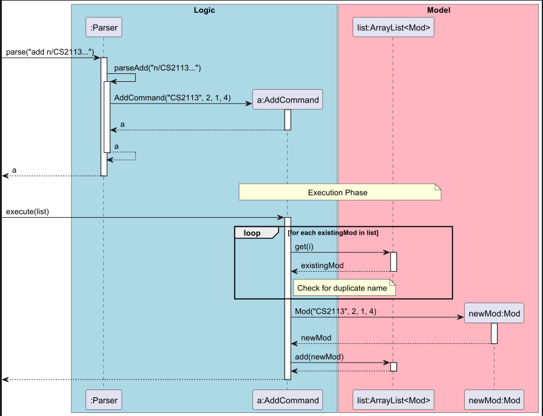

# Developer Guide

## Acknowledgements

* **AddressBook-Level 3 (AB3):** The architectural design, Developer Guide structure, and certain Command pattern implementations were adapted from the [AddressBook-Level 3 project](https://se-education.org/addressbook-level3/) created by the SE-EDU initiative.
* **Individual Projects (iP):** The core CLI parsing logic and the task-handling structures were adapted from the team members' individual projects which served as a foundation for the Command and Parser classes in ModTrack.
## Design & implementation

{Describe the design and implementation of the product. Use UML diagrams and short code snippets where applicable.}

### Storage component

**API:** `Storage.java`



The `Storage` component,

* can save and load module tracking data in a pipe-delimited text format, and read them back into corresponding `Mod` objects.
* handles the initialization of the local data directory and file (`./data/ModTrack.txt`) automatically upon startup.
* depends on classes in the `Model` component (because the `Storage` component's job is to save/retrieve `Mod` objects that belong to the `Model`).

### Command Mechanism

The Command mechanism is facilitated by the abstract `Command` class. It serves as the base for all executable actions within **ModTrack**, allowing the `Parser` to delegate logic to specific command objects.

#### Implementation

The abstract `Command` class defines a core method: `execute(ArrayList<Mod> list)`. Concrete subclasses implement this method to perform specific operations on the module list.

While the system includes several commands (such as `MarkCommand`, `ListCommand`, and `ExitCommand`), the following classes represent the primary data-manipulation logic:

* **`AddCommand`**: Stores details for a new module (`name`, `year`, `semester`, `credits`). Its `execute` method performs a duplicate check before adding a new `Mod` object to the list.
* **`DeleteCommand`**: Stores a `modName` string. Its `execute` method iterates through the list to find and remove the matching module.

**Code Snippet: Abstract Command Structure**
```java
public abstract class Command {
    protected boolean isExit = false;
    public abstract void execute(ArrayList<Mod> list);
    public boolean isExit() { return this.isExit; }
}
```
The following sequence diagram shows how an add operation goes through the `Logic` component:


The following sequence diagram shows how a delete operation goes through the `Logic` component:


#### Design Considerations

**Aspect: How commands interact with the module list**

* **Alternative 1 (Current implementation):** Commands receive the `ArrayList<Mod>` directly in the `execute` method.
    * **Pros:** Simple to implement and maintain for the current project scope.
    * **Cons:** High coupling between commands and the specific data structure used.
* **Alternative 2:** Use a dedicated `Model` manager class to encapsulate list operations.
    * **Pros:** Lower coupling and better separation of concerns.
    * **Cons:** Increases complexity and the number of classes, which may be unnecessary for a CLI-based tracker.

**Aspect: Data Validation**

* **Approach:** Concrete commands handle their own internal validation. For instance, `AddCommand` prevents duplicate entries by checking the existing list, while `DeleteCommand` provides feedback if a module is not found.
* **Reasoning:** This ensures that the "business rules" for a specific action are contained within the class responsible for that action, leading to high functional cohesion.

## Product scope
### Target user profile

The target user for **ModTrack** is a **National University of Singapore (NUS) Computer Engineering student** who:
* prefers a **Command Line Interface (CLI)** over a Graphical User Interface (GUI) for speed and efficiency.
* manages a complex curriculum involving both School of Computing and Faculty of Engineering requirements.
* needs to track technical electives, core modules, and breadth requirements across multiple semesters.
* is comfortable with terminal-based workflows and seeks a lightweight tool for academic planning.

### Value proposition

**ModTrack** solves the problem of navigating the complex graduation requirements of the Computer Engineering degree. While official university portals are useful for formal registration, they can be cumbersome for quick "what-if" planning or tracking progress toward a degree.

This application provides:
* **Requirement Tracking:** A centralized view to see which specific graduation requirements (e.g., General Education, Core Modules, and Electives) have been fulfilled and which are still outstanding.
* **Academic Logging:** A historical record of modules completed, including year, semester, and credit details.
* **Efficiency:** Rapid data entry and retrieval using short, optimized commands specifically designed for busy engineering students.
* **Clarity:** Instant feedback on current progress, helping students ensure they are on track to graduate by their target date without needing to manually cross-reference various PDFs or websites.

## User Stories

|Version| As a ... | I want to ... | So that I can ...|
|--------|----------|---------------|------------------|
|v1.0|new user|see usage instructions|refer to them when I forget how to use the application|
|v2.0|user|find a to-do item by name|locate a to-do without having to go through the entire list|

## Non-Functional Requirements

{Give non-functional requirements}

## Glossary

* *glossary item* - Definition

## Instructions for manual testing

{Give instructions on how to do a manual product testing e.g., how to load sample data to be used for testing}
