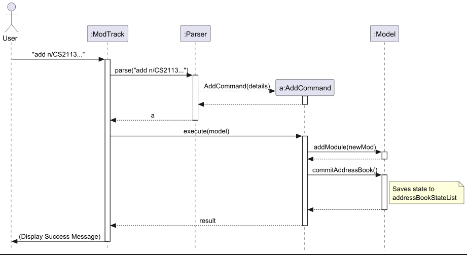
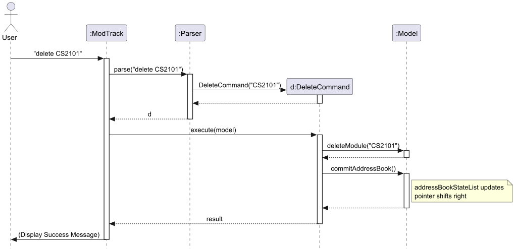
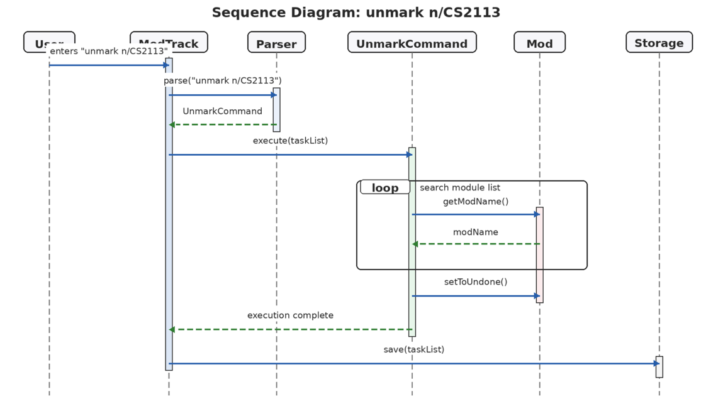
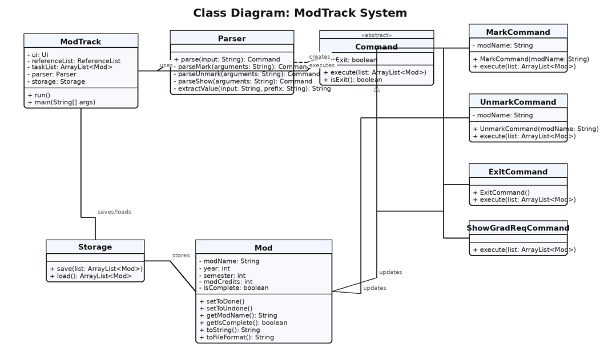
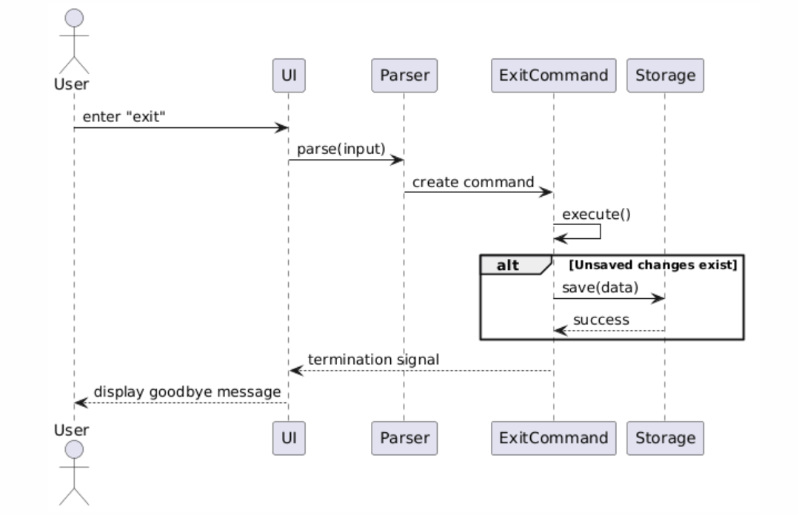
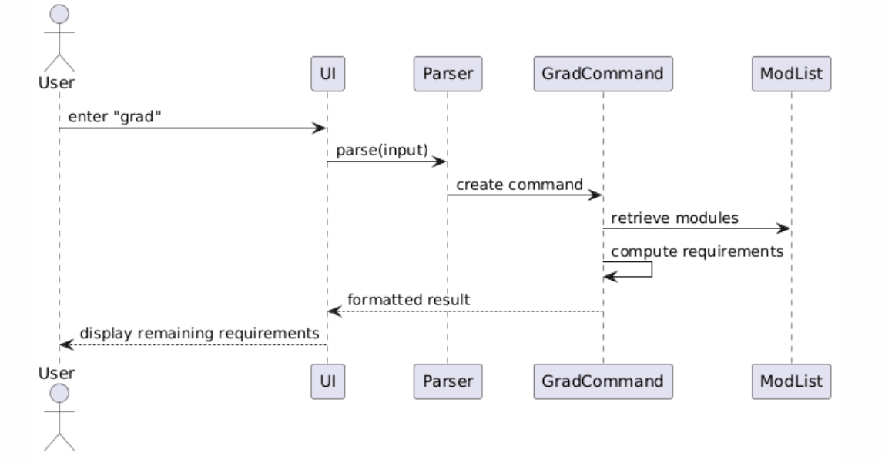

# CS2113 T09-1 tp Developer Guide

## Acknowledgements

* **AddressBook-Level 3 (AB3):** The architectural design, Developer Guide structure, and certain Command pattern implementations were adapted from the [AddressBook-Level 3 project](https://se-education.org/addressbook-level3/) created by the SE-EDU initiative.
* **Individual Projects (iP):** The core CLI parsing logic and the task-handling structures were adapted from the team members' individual projects which served as a foundation for the Command and Parser classes in ModTrack.

## Table of Contents
1. [Setup Guide](#setup-guide)

2. [Design](#design)
    - [UI component](#ui-component)
    - [Command component](#command-component)
    - [Storage component](#storage-component)
    - [Parser component](#parser-component)

3. [Implementation](#implementation)
    - [Haofu's enhancements](#haofus-enhancements)
        - [Add feature](#1-add-feature)
        - [Delete feature](#2-delete-feature)
    - [Yang Han's enchancements](#yang-hans-enchancement)
        - [List feature](#3-list-feature)
    - [Christina's enhancement](#christinas-enchancements)
        - [Mark feature](#4-mark-feature)
        - [Unmark feature](#5-unmark-feature)
    - [Ang Lee's enhancement](#ang-lees-enhancements)
        - [Exit feature](#6-exit-feature)
        - [Show Graduation Requirement feature](#7-show-graduation-requirement-feature)

4. [Product Scope](#product-scope)
    - [Target User Profile](#target-user-profile)
    - [Value Proposition](#value-proposition)

5. [User Stories](#user-stories)

6. [Non-Functional Requirements](#non-functional-requirements)

7. [Glossary](#glossary)

## Setup Guide

### Steps

1. Download the tp.jar file from release v1.0 into the folder where you plan to run the application

2. Go to project folder where the jar file is located

3. Run the application using java
```
java -jar tp.jar
```

{list here sources of all reused/adapted ideas, code, documentation, and third-party libraries -- include links to the original source as well}

## Design
**ModTrack** (Modtrack.java) launches the application and shuts it down when the exit command is called:
- At program start: It calls

### UI Component

The UI component is responsible for handling interactions between the user and the system. In **ModTrack**, the UI is implemented as a Command Line Interface (CLI).

The UI reads user input from standard input and displays output to standard output. It delegates the processing of user commands to the `Parser` component.

The main responsibilities of the UI component are:
- Reading user input
- Displaying responses from commands
- Handling application start-up and shutdown messages

The UI does not contain any business logic, adhering to separation of concerns.

### Command Component
The Command mechanism is facilitated by the abstract `Command` class. It serves as the base for all executable actions within **ModTrack**, allowing the `Parser` to delegate logic to specific command objects.

The abstract `Command` class defines a core method: `execute(ArrayList<Mod> list)`. Concrete subclasses implement this method to perform specific operations on the module list.

While the system includes several commands (such as `MarkCommand`, `ListCommand`, and `ExitCommand`), the following classes represent the primary data-manipulation logic:

**Code Snippet: Abstract Command Structure**
```java
public abstract class Command {
    protected boolean isExit = false;
    public abstract void execute(ArrayList<Mod> list);
    public boolean isExit() { return this.isExit; }
}
```
#### Design Considerations

**Aspect: How commands interact with the module list**

* **Alternative 1 (Current implementation):** Commands receive the `ArrayList<Mod>` directly in the `execute` method.
    * **Pros:** Simple to implement and maintain for the current project scope.
    * **Cons:** High coupling between commands and the specific data structure used.
* **Alternative 2:** Use a dedicated `Model` manager class to encapsulate list operations.
    * **Pros:** Lower coupling and better separation of concerns.
    * **Cons:** Increases complexity and the number of classes, which may be unnecessary for a CLI-based tracker.

**Aspect: Data Validation**

* **Approach:** Concrete commands handle their own internal validation. For instance, `AddCommand` prevents duplicate entries by checking the existing list, while `DeleteCommand` provides feedback if a module is not found.
* **Reasoning:** This ensures that the "business rules" for a specific action are contained within the class responsible for that action, leading to high functional cohesion.

### Storage Component

**API:** `Storage.java`


The `Storage` component,

* can save and load module tracking data in a pipe-delimited text format, and read them back into corresponding `Mod` objects.
* handles the initialization of the local data directory and file (`./data/ModTrack.txt`) automatically upon startup.
* depends on classes in the `Model` component (because the `Storage` component's job is to save/retrieve `Mod` objects that belong to the `Model`).

### Parser Component

The Parser component is responsible for interpreting user input and converting it into executable commands.

It performs the following steps:
1. Reads raw user input
2. Identifies the command keyword (e.g., `add`, `delete`, `list`)
3. Extracts relevant arguments
4. Constructs the corresponding `Command` object

For example:
- Input: `add n/CS2113 y/Y2 s/S1`
- Output: `AddCommand` object with parsed parameters

The Parser ensures that invalid inputs are handled gracefully by throwing appropriate exceptions.


{Describe the design and implementation of the product. Use UML diagrams and short code snippets where applicable.}

## Implementation
### Haofu's enhancements
#### 1. Add Feature
The **`AddCommand`** facilitates the addition of new modules to the application by storing details such as `name`, `year`, `semester`, and `credits`.

**Implementation**

The addition mechanism is facilitated by `VersionedAddressBook`. When a user executes the `AddCommand`, the `execute` method first performs a duplicate check. If the module is unique, it is added to the list. The `AddCommand` then calls `Model#commitAddressBook()`, causing the modified state of the address book after the addition to be saved in the `addressBookStateList`, and the `currentStatePointer` is shifted to the newly inserted address book state.

> [!NOTE]
> If the command fails its execution (e.g., a duplicate module is found), it will not call `Model#commitAddressBook()`, so the address book state will not be saved into the `addressBookStateList`.

The following sequence diagram shows how an add operation goes through the `Logic` component:


---

#### 2. Delete Feature
The **`DeleteCommand`** allows for the removal of a module from the list using a `modName` string.

**Implementation**

The deletion mechanism is also facilitated by `VersionedAddressBook`. Upon execution, the `DeleteCommand` iterates through the list to find the matching module. If a match is found and removed, the command calls `Model#commitAddressBook()`. This causes the modified state of the address book—now excluding the deleted module—to be saved in the `addressBookStateList`, and the `currentStatePointer` is shifted to the newly inserted address book state.

The following sequence diagram shows how a delete operation goes through the `Logic` component:


### Yang Han's enhancements
#### List Feature

User inputs `List` `List c/`

The List feature is executed by the `ListCommand.java` (`List`) or the `ListCompareCommand. java` (`List c/`) class.
It extends from the abstract class `Command` and overrides the `execute()` method.

V1.0 Current implementation:
The `execute()` method in the `ListCommand` class iterates through the list of modules tracked by the program and prints out
all modules currently tracked using the `toString()` method of the mod class.

V2.0 implementation:
The `execute()` method in the `ListCompareCommand` class iterates through the list of modules tracked by the program
and compares it to a predefined list of all modules required to be completed by a computer engineering student. prints
output completed and uncompleted modules in 2 separate lists using the `toString()` method of the mod class.

Design Considerations:
* The list feature is implemented this way because we want to allow the user the ability to view their modules tracked
  as is or against the modules required to graduate.
* Under `ListCompareCommand` we compare the list of modules tracked to a predefined list, populated on start up
  to allow easy updates when there is a change in graduation requirements or for scaling the program to other majors.
* Two separate classes was chosen as we wanted to a streamlined command class where each command overrides the execute
  method in their respective command classes.
* Alternatives considered: Using a single command class and separating the executions by methods within the class.
  This was rejected as it will cause list to have a different structure from the other command classes causing confusion.

#### Sequence Diagram
`List` command Sequence Diagram


`List c/` command Sequence Diagram 


### Christina's enchancements
#### 4. Mark Feature

The **`MarkCommand`** allows the user to mark a tracked module as completed by specifying its module code.

**Implementation**

The marking mechanism is facilitated by the `MarkCommand` class. When a user executes the `mark` command, the `execute()` method iterates through the tracked module list to find a module whose name matches the provided `modName`.

If a matching module is found:
- its completion status is updated using `Mod#setToDone()`
- a confirmation message is printed to the user

If no matching module is found, the system informs the user that the module does not exist in the current tracked list.

This feature is important because it allows users to update their academic progress after completing a module.

**Example:**
```text
mark n/CS2113
```

##### Design Considerations

**Aspect: How modules are identified for marking**

* **Alternative 1 (Current implementation):** Identify the module by its module code (`modName`) using a linear search through the list.
    * **Pros:** Simple and easy to understand for the current scope of the project.
    * **Cons:** Less efficient for very large module lists.
* **Alternative 2:** Use an index-based marking system (e.g. `mark 3`) or a `HashMap<String, Mod>` for faster lookup.
    * **Pros:** Potentially faster lookup and simpler internal retrieval.
    * **Cons:** Less intuitive for users, and would require additional synchronization between displayed indices and stored data.

**Reasoning:**  
The current implementation was chosen because module codes such as `CS2113` are already unique and meaningful to the user, making command usage more natural in a CLI-based academic tracker.

##### Sequence Diagram


The sequence diagram above shows how the `mark` command is handled:
1. The user enters the `mark` command
2. The `Parser` creates a `MarkCommand`
3. `MarkCommand` iterates through the tracked module list
4. If a matching module is found, its completion status is updated
5. The updated list is saved through the `Storage` component

---

#### 5. Unmark Feature

The **`UnmarkCommand`** allows the user to reverse a previously completed module and set it back to incomplete.

**Implementation**

The unmarking mechanism is facilitated by the `UnmarkCommand` class. It follows a similar implementation pattern to `MarkCommand`.

When a user executes the `unmark` command:
- the system searches the module list for a module matching the provided `modName`
- if found, the module’s completion status is reset using `Mod#setToUndone()`
- the user is informed that the module has been marked as incomplete again

This feature is useful when users make accidental updates or wish to revise their academic planning.

**Example:**
```text
unmark n/CS2113
```

##### Design Considerations

**Aspect: Whether to merge mark and unmark into one command**

* **Alternative 1 (Current implementation):** Implement `mark` and `unmark` as two separate command classes.
    * **Pros:** Clear separation of responsibilities and more intuitive command structure.
    * **Cons:** Slight code duplication due to similar search logic.
* **Alternative 2:** Use a single generic status command such as `status n/CS2113 s/incomplete`.
    * **Pros:** More extensible for future status types.
    * **Cons:** Adds unnecessary parsing complexity and makes the command less user-friendly.

**Reasoning:**  
The current implementation was chosen to keep user interactions simple and explicit. Since the application is intended for fast CLI usage, direct commands such as `mark` and `unmark` are easier for users to remember and use.

##### Sequence Diagram



The sequence diagram above shows how the `unmark` command is handled:
1. The user enters the `unmark` command
2. The `Parser` creates an `UnmarkCommand`
3. `UnmarkCommand` iterates through the tracked module list
4. If a matching module is found, its completion status is reset
5. The updated list is saved through the `Storage` component

##### UML Class Diagram



The class diagram above illustrates the command-based architecture used in ModTrack. `ModTrack` acts as the central controller of the application and coordinates interactions between the `Parser`, `Storage`, and the module list. The `Parser` is responsible for converting raw user input into a concrete subclass of the abstract `Command` class.

The `Command` abstraction allows different user actions to be encapsulated into separate classes such as `MarkCommand`, `UnmarkCommand`, `ExitCommand`, and `ShowGradReqCommand`. This design promotes modularity by ensuring that each command handles only one responsibility.

Besides `mark` and `unmark`, the application also supports other core command interactions such as `exit` and `show grad req`. These commands follow the same command-based design architecture, where the `Parser` maps user input into a specific subclass of `Command`, and the `ModTrack` main loop executes the corresponding action.

This design allows the application to remain modular and scalable, as future commands can be introduced with minimal changes to the overall control flow.

### Ang Lee's enhancements
#### 6. Exit Feature

The exit mechanism is facilitated by the `ExitCommand` class.

**How it works:**
- When executed, the application terminates gracefully
- Any pending data is saved before exit

**Example:**
```
exit
```
##### Sequence Diagram


The sequence diagram above shows how the exit command is handled:
1. The user enters the `exit` command
2. The input is parsed into an `ExitCommand`
3. The command executes and checks for unsaved data
4. If necessary, data is saved via the Storage component
5. The system terminates gracefully and displays a farewell message

#### 7. Show Graduation Requirement Feature
This feature displays the graduation requirements tracked by the system.

**How it works:**
- Retrieves stored module data
- Compares against graduation criteria
- Displays remaining requirements to the user

**Example:**
```
show grad req
```
#### Sequence Diagram


The sequence diagram illustrates how graduation requirements are displayed:
1. The user enters the `grad` command
2. The Parser creates a `GradCommand`
3. The command retrieves all modules from the list
4. It computes completed and remaining requirements
5. The results are formatted and displayed to the user

## Product scope
### Target user profile

The target user for **ModTrack** is a **National University of Singapore (NUS) Computer Engineering student** who:
* prefers a **Command Line Interface (CLI)** over a Graphical User Interface (GUI) for speed and efficiency.
* manages a complex curriculum involving both School of Computing and Faculty of Engineering requirements.
* needs to track technical electives, core modules, and breadth requirements across multiple semesters.
* is comfortable with terminal-based workflows and seeks a lightweight tool for academic planning.

### Value proposition

**ModTrack** solves the problem of navigating the complex graduation requirements of the Computer Engineering degree. While official university portals are useful for formal registration, they can be cumbersome for quick "what-if" planning or tracking progress toward a degree.

This application provides:
* **Requirement Tracking:** A centralized view to see which specific graduation requirements (e.g., General Education, Core Modules, and Electives) have been fulfilled and which are still outstanding.
* **Academic Logging:** A historical record of modules completed, including year, semester, and credit details.
* **Efficiency:** Rapid data entry and retrieval using short, optimized commands specifically designed for busy engineering students.
* **Clarity:** Instant feedback on current progress, helping students ensure they are on track to graduate by their target date without needing to manually cross-reference various PDFs or websites.

## User Stories

|Version| As a ... | I want to ... | So that I can ...|
|--------|----------|---------------|------------------|
|v1.0|new user|see usage instructions|refer to them when I forget how to use the application|
|v1.0|user|add a module with its module code and title|record modules I have taken|
|v1.0|user|delete a module entry|remove modules I added by mistake|
|v1.0|user|mark a module as completed|track my academic progress|
|v1.0|user|view all completed modules|know what I have fulfilled|
|v1.0|user|view all uncompleted required modules|plan future semesters|
|v1.0|user|view the total modular credits earned|track my graduation progress|
|v1.0|user|view the remaining modular credits required|plan my remaining semesters|
|v1.0|user|compare my completed modules with graduation requirements|see unmet requirement|
|v1.0|user|assign a module to a specific semester|track when I took it|


## Non-Functional Requirements

1. The application should run on any system with Java installed
2. The application should respond within 1 second for typical commands
3. Data should be persisted across sessions
4. The system should handle invalid input gracefully
5. The application should be usable entirely via CLI

## Glossary

* *Module* - A course taken by a student
* *Command* - An executable instruction entered by the user
* *Parser* - Component that interprets user input

## Instructions for manual testing

{Give instructions on how to do a manual product testing e.g., how to load sample data to be used for testing}
