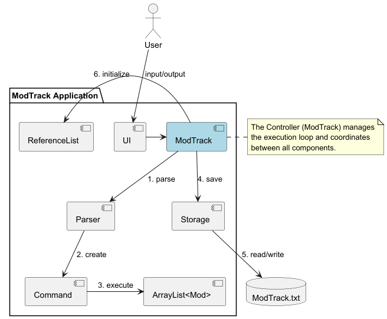
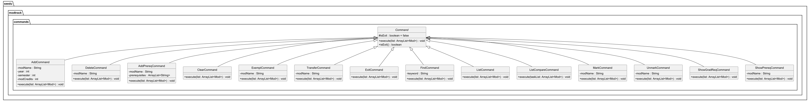
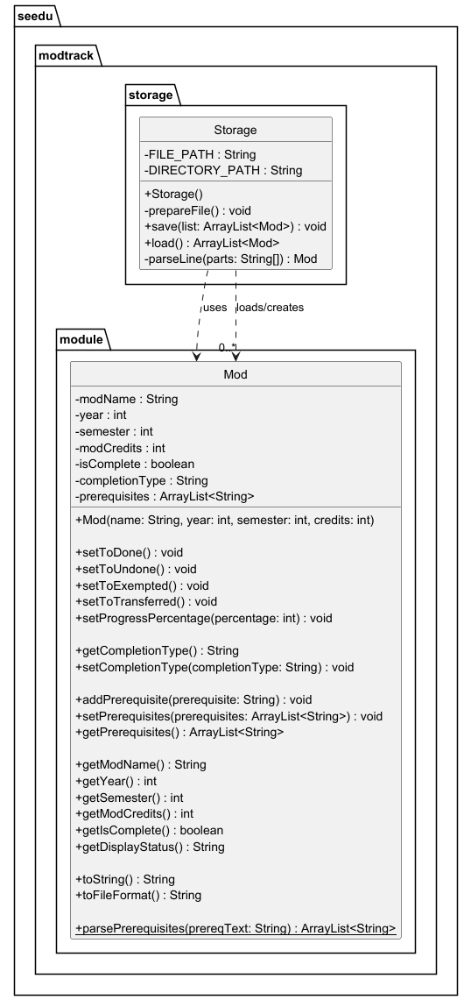
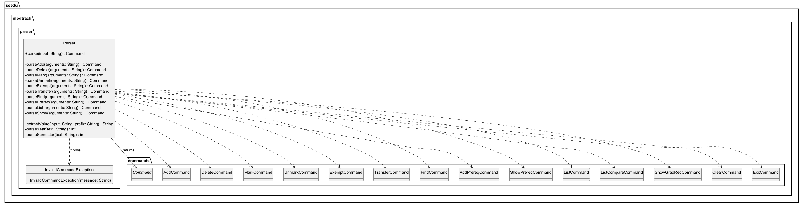
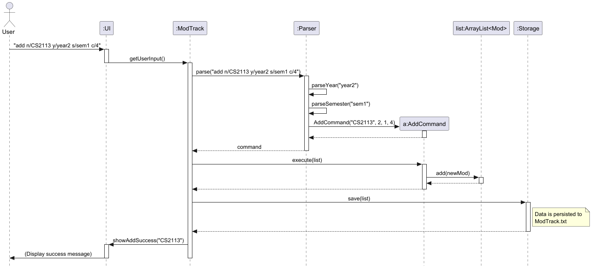
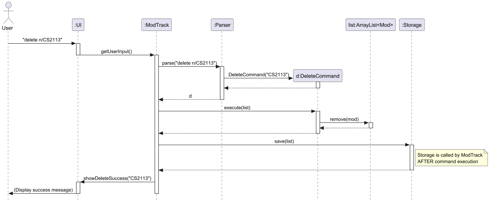
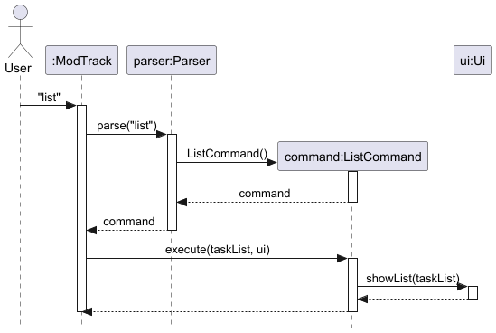
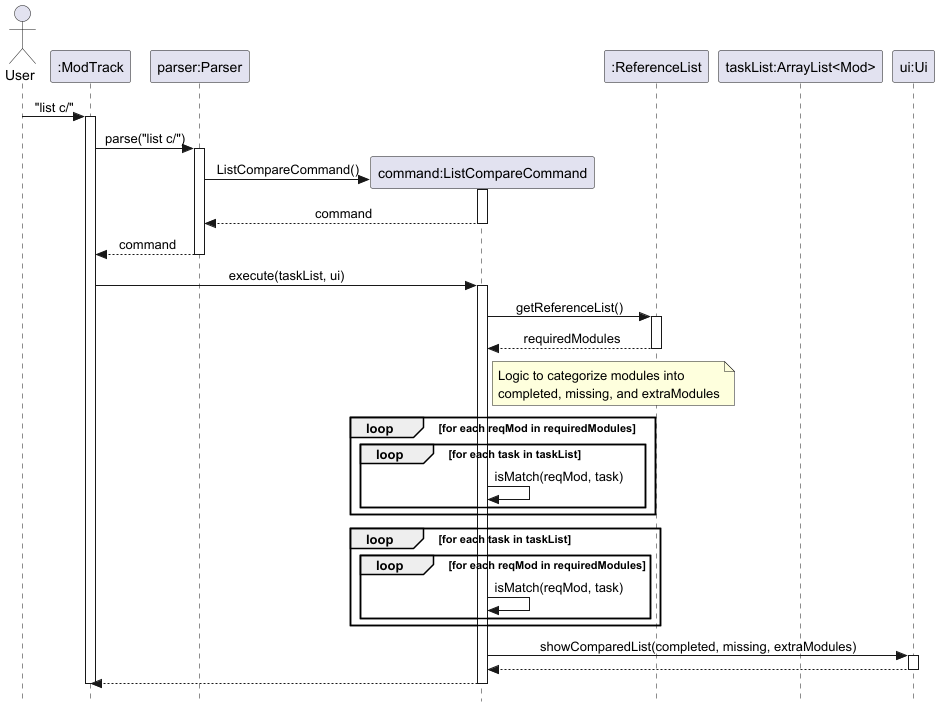

# CS2113 T09-1 tp Developer Guide

## Acknowledgements

* **AddressBook-Level 3 (AB3):** The architectural design, Developer Guide structure, and certain Command pattern implementations were adapted from the [AddressBook-Level 3 project](https://se-education.org/addressbook-level3/) created by the SE-EDU initiative.
* **Individual Projects (iP):** The core CLI parsing logic and the task-handling structures were adapted from the team members' individual projects which served as a foundation for the Command and Parser classes in ModTrack.

## Table of Contents
1. [Setup Guide](#setup-guide)

2. [Design](#design)
    - [UI component](#ui-component)
    - [Command component](#command-component)
    - [Storage component](#storage-component)
    - [Parser component](#parser-component)

3. [Implementation](#implementation)
        - [Add feature](#1-add-feature)
        - [Delete feature](#2-delete-feature)
        - [List feature](#3-list-feature)
        - [Mark feature](#4-mark-feature)
        - [Unmark feature](#5-unmark-feature)
        - [Exit feature](#6-exit-feature)
        - [Show Graduation Requirement feature](#7-show-graduation-requirement-feature)

4. [Product Scope](#product-scope)
    - [Target User Profile](#target-user-profile)
    - [Value Proposition](#value-proposition)

5. [User Stories](#user-stories)

6. [Non-Functional Requirements](#non-functional-requirements)

7. [Glossary](#glossary)

## Setup Guide

### Steps

1. Download the modtrack.jar file from release v2.0 into the folder where you plan to run the application

2. Go to project folder where the jar file is located

3. Run the application using java
```
java -jar modtrack.jar
```

## Design

### Architecture Overview

The Architecture Diagram below provides a high-level overview of the ModTrack application.



The application consists of five main components:
* **`ModTrack`**: The main controller that manages the execution loop and component orchestration.
* **`UI`**: Handles the user interface, including reading input and displaying messages.
* **`Logic`**: Consists of the `Parser` and various `Command` classes to process user requests.
* **`Model`**: Holds the in-memory data, primarily an `ArrayList<Mod>` and the `ReferenceList`.
* **`Storage`**: Manages reading from and writing to the `ModTrack.txt` data file.

### Component Initialization

The **ModTrack** class (`ModTrack.java`) is responsible for launching the application and managing the lifecycle of each component.

**At program start:**
1. **Component Initialization**: `ModTrack` initializes the `UI`, `ReferenceList`, `Parser`, and `Storage`.
2. **Reference Data Loading**: It calls `ReferenceList#populateReferenceList()` to load static module data.
3. **Data Retrieval**: It calls `Storage#load()` to populate the `taskList` (the Model) with existing data from the disk.
4. **Main Loop**: It enters a `while` loop that continues until an `ExitCommand` is executed.

**During execution:**
For every user input, `ModTrack` coordinates the following sequence:
1. It passes the raw input to the **`Parser`** to generate a **`Command`**.
2. It calls the **`Command#execute()`** method to update the **`Model`**.
3. It calls **`Storage#save()`** immediately after execution to ensure data persistence.
4. It uses the **`UI`** to display the outcome of the command to the user.

### UI Component


**Figure X. Structure of the UI Component**

The `Ui` component is responsible for handling all user interactions in ModTrack via the Command Line Interface (CLI).

ModTrack uses a **text-based UI**, where all interactions are displayed through standard output (`System.out`).

The `Ui` component,

* displays messages to the user (e.g., welcome message, errors, confirmations).
* formats and prints module-related information (e.g., lists, prerequisites, comparisons).
* acts as the final output stage after command execution.
* does **not** handle any business logic or data manipulation.

#### Structure

The `Ui` component consists of a single main class:

- `Ui`
  - Contains methods responsible for displaying specific outputs.
  - Examples:
    - `showAddModule(...)`
    - `showDeletedModule(...)`
    - `showList(...)`
    - `showPrerequisites(...)`
    - `showComparedList(...)`

Each method is designed to handle a **single responsibility**, ensuring modularity and ease of maintenance.

#### How the UI interacts with other components

The following sequence diagram shows how the `Ui` component interacts with other components when a user executes the `add` command.


### Command Component
The Command mechanism is facilitated by the abstract `Command` class. It serves as the base for all executable actions within **ModTrack**, allowing the `Parser` to delegate logic to specific command objects.

Class Diagram:


The abstract `Command` class defines a core method: `execute(ArrayList<Mod> list, Ui ui)`. Concrete subclasses implement this method to perform specific operations on the module list.

While the system includes several commands (such as `MarkCommand`, `ListCommand`, and `ExitCommand`), the following classes represent the primary data-manipulation logic:

**Code Snippet: Abstract Command Structure**
```java
public abstract class Command {
    protected boolean isExit = false;
    public abstract void execute(ArrayList<Mod> list, Ui ui);
    public boolean isExit() { return this.isExit; }
}
```
#### Design Considerations

**Aspect: How commands interact with the module list**

* **Alternative 1 (Current implementation):** Commands receive the `ArrayList<Mod>` directly in the `execute` method.
    * **Pros:** Simple to implement and maintain for the current project scope.
    * **Cons:** High coupling between commands and the specific data structure used.
* **Alternative 2:** Use a dedicated `Model` manager class to encapsulate list operations.
    * **Pros:** Lower coupling and better separation of concerns.
    * **Cons:** Increases complexity and the number of classes, which may be unnecessary for a CLI-based tracker.

**Aspect: Data Validation**

* **Approach:** Concrete commands handle their own internal validation. For instance, `AddCommand` prevents duplicate entries by checking the existing list, while `DeleteCommand` provides feedback if a module is not found.
* **Reasoning:** This ensures that the "business rules" for a specific action are contained within the class responsible for that action, leading to high functional cohesion.

### Storage Component

Class Diagram:


The `Storage` component,

* can save and load module tracking data in a pipe-delimited text format, and read them back into corresponding `Mod` objects.
* handles the initialization of the local data directory and file (`./data/ModTrack.txt`) automatically upon startup.
* depends on classes in the `Model` component (because the `Storage` component's job is to save/retrieve `Mod` objects that belong to the `Model`).

### Parser Component

The Parser component is responsible for interpreting user input and converting it into executable commands.

It performs the following steps:
1. Reads raw user input
2. Identifies the command keyword (e.g., `add`, `delete`, `list`)
3. Extracts relevant arguments
4. Constructs the corresponding `Command` object

For example:
- Input: `add n/CS2113 y/Year2 s/Sem1`
- Output: `AddCommand` object with parsed parameters

The Parser ensures that invalid inputs are handled gracefully by throwing appropriate exceptions.

Class Diagram:



## Implementation
#### 1. Add Feature
The **`AddCommand`** facilitates the addition of new modules to the application by storing details such as `name`, `year`, `semester`, and `credits`.

**Implementation**

> If the command fails its execution (e.g., a duplicate module is found), the `AddCommand` returns early. Consequently, the list remains unchanged and the `ModTrack` main loop will skip the save process or save the unmodified state, ensuring no invalid data is persisted.

**Example:**

```text
add n/CS2113 y/2 s/1 c/4
```

##### Parsing Logic

The `Parser` identifies the `add` keyword and extracts:

* the module name from the `n/` prefix
* the academic year from the `y/` prefix
* the semester from the `s/` prefix
* the modular credits from the `c/` prefix

The extracted values are used to construct an `AddCommand` object, which is then passed to the main execution loop.

##### Class Interaction

* `Parser` constructs the `AddCommand`
* `AddCommand` validates the input against the existing `ArrayList<Mod>`
* `Mod` represents the newly created module object
* `Storage` persists the updated module list after successful execution

##### Edge Cases and Error Handling

The feature currently handles the following cases:

* duplicate module codes
* invalid or missing command arguments rejected by the parser
* failed addition does not modify the tracked list

##### Current Limitation

The current implementation relies on linear search to detect duplicate module codes. This is acceptable for the current project scope, but may become less efficient if the module list grows significantly.

##### Cross-Feature Interaction

The add feature provides the base module objects used by all other commands. Features such as `mark`, `unmark`, `transfer`, `addprereq`, and `showprereq` depend on the module having already been added to the tracked list.


The following sequence diagram shows how an add operation goes through the `Logic` component:


---

#### 2. Delete Feature
The **`DeleteCommand`** allows for the removal of a module from the list using a `modName` string.

**Implementation**

The deletion mechanism is managed by the **Logic** component and persisted via the **Storage** component. Upon execution, the `DeleteCommand` iterates through the `ArrayList<Mod>` to find the matching module. If a match is found and removed, the main loop in `ModTrack` immediately calls `Storage#save()` to overwrite the data file with the updated list, ensuring the change is persisted to the disk.

**Example:**

```text
delete n/CS2113
```

##### Parsing Logic

The `Parser` identifies the `delete` keyword and extracts the module name from the `n/` prefix.

A `DeleteCommand` object is then created and passed to the execution loop.

##### Class Interaction

* `Parser` constructs the `DeleteCommand`
* `DeleteCommand` searches through the `ArrayList<Mod>`
* the matching `Mod` object is removed from the list if found
* `Storage` persists the updated module list after execution

##### Edge Cases and Error Handling

The feature currently handles the following cases:

* deletion of a non-existent module
* failed deletion leaves the tracked list unchanged
* parser rejects malformed input before execution

##### Current Limitation

The current implementation removes modules solely by module code and does not check whether other features, such as prerequisite tracking, still reference the deleted module as a prerequisite string.

##### Cross-Feature Interaction

Deleting a module may affect commands such as `showprereq`, `transfer`, `mark`, and `unmark`, because those commands rely on the module continuing to exist in the tracked list. If a deleted module was previously referenced elsewhere as a prerequisite, that reference remains as plain string data.


The following sequence diagram shows how a delete operation goes through the `Logic` component:


#### 3. Clear Feature
The **`ClearCommand`** allows for the removal of all modules from the tracker, effectively resetting the user's data list.

**Implementation**

The clear mechanism is managed by the **Logic** component and involves a two-step verification process to prevent accidental data loss:

1. **Confirmation Prompt**: Upon execution, `ClearCommand` interacts with the `UI` to display a warning and request explicit user confirmation (e.g., typing 'yes').
2. **Execution Gate**:
    * If the user **declines** or provides invalid confirmation, the command terminates early, and the module list remains unchanged.
    * If the user **confirms**, the command calls the `clear()` method on the `ArrayList<Mod>`, removing all tracked modules from memory.

**Persistence**

Following a successful (confirmed) execution, the main loop in `ModTrack` calls `Storage#save()` to overwrite the data file with an empty list. If the operation was cancelled during the confirmation step, the save call effectively persists the original, unmodified list, ensuring no data is lost.

> [!IMPORTANT]
> This operation is irreversible once confirmed and saved, as the existing `ModTrack.txt` file is overwritten with a blank state.

**Example:**

```text
clear
```

##### Parsing Logic
The `Parser` identifies the `clear` keyword and constructs a `ClearCommand` object. No additional arguments or flags are required.

##### Class Interaction
* **`Parser`**: Constructs the `ClearCommand`.
* **`ClearCommand`**: Invokes `Ui#getClearConfirmation()` to halt execution until the user provides a "yes" input.
* **`ArrayList<Mod>`**: If confirmed, `clear()` is invoked on the list to remove all `Mod` objects.
* **`Storage`**: Overwrites the data file with the empty list state immediately after successful execution.

##### Guard Mechanism (New)
To mitigate the risk of accidental data loss, the `ClearCommand` implements a **blocking confirmation gate**. The logic checks for a case-insensitive "yes" string from the standard input. Any other input (including "no" or accidental keystrokes) will abort the command and keep the module list intact.

##### Edge Cases and Error Handling
* **Empty List**: Clearing an already empty list is allowed; the user is still prompted for confirmation, and the storage file is refreshed.
* **Aborted Confirmation**: If the user cancels the prompt, the system logs the cancellation and returns to the main execution loop without modifying the data file.

##### Cross-Feature Interaction
This command serves as a hard reset for the application state. After a successful `clear`, features like `list c/` (Graduation Comparison) will report all requirements as "Missing" until the `ReferenceList` is re-populated via new `add` commands.

The following sequence diagram shows how a clear operation goes through the system:


#### 4. List Feature

User inputs `List` `List c/`

The List feature is executed by the `ListCommand.java` (`List`) or the `ListCompareCommand.java` (`List c/`) class.
It extends from the abstract class `Command` and overrides the `execute()` method.

**ListCommand implementation:**
The `execute()` method in the `ListCommand` class iterates through the list of modules tracked by the program and prints out
all modules currently tracked using the `toString()` method of the mod class.

**ListCompareCommand implementation:**
The `execute()` method in the `ListCompareCommand` class iterates through the list of modules tracked by the program
and compares it to a predefined list of all modules required to be completed by a computer engineering student. prints
output completed and uncompleted modules in 2 separate lists using the `toString()` method of the mod class.

#### Design Considerations:
* The list feature is implemented this way because we want to allow the user the ability to view their modules tracked
  as is or against the modules required to graduate.
* Under `ListCompareCommand` we compare the list of modules tracked to a predefined list, populated on start up
  to allow easy updates when there is a change in graduation requirements or for scaling the program to other majors.
* Two separate classes was chosen as we wanted to a streamlined command class where each command overrides the execute
  method in their respective command classes.
* Alternatives considered: Using a single command class and separating the executions by methods within the class.
  This was rejected as it will cause list to have a different structure from the other command classes causing confusion.

**Example:**

```text
list
```
```text
list c/
```
##### Parsing Logic

The `Parser` identifies the `list` keyword and determines whether the compare modifier `c/` is present:

* if absent, it constructs a `ListCommand`
* if present, it constructs a `ListCompareCommand`

##### Class Interaction

* `Parser` constructs either `ListCommand` or `ListCompareCommand`
* `ListCommand` reads from the `ArrayList<Mod>` and prints tracked modules
* `ListCompareCommand` reads from both the `ArrayList<Mod>` and `ReferenceList`
* `Mod` provides display-ready information through `toString()` and status-related methods

##### Edge Cases and Error Handling

The feature currently handles the following cases:

* empty tracked module lists
* tracked modules that are completed, incomplete, or transferred
* comparison against predefined reference requirements

##### Current Limitation

The comparison feature depends on a predefined reference list and is currently specific to the configured degree requirements. Expanding to other programmes would require updating the reference data source.

##### Cross-Feature Interaction

The list features reflect the effects of commands such as `add`, `delete`, `mark`, `unmark`, and `transfer`. In particular, transferred modules appear as completed for requirement comparison purposes.


#### Sequence Diagram
`List` command Sequence Diagram


`List c/` command Sequence Diagram 


#### 5. Find Feature
The **`FindCommand`** allows users to filter their tracked module list by searching for specific keywords. This is a read-only operation that does not modify the underlying data.

**Implementation**

The search mechanism is facilitated by the `FindCommand` class. Upon execution, the `execute()` method performs a two-stage process:

1.  **Filtering**: It calls the internal helper method `findAllMatches(taskList)`, which performs a case-insensitive linear search. It populates a new `ArrayList<Mod>` containing all modules where the name contains the search keyword.
2.  **Display**:
    * If matches are found, the command iterates through the results and calls `ui.showMatchingModule(mod)`.
    * If the result list is empty, it triggers `ui.showNoModulesFound()`.

##### **Example:**
```text
find n/CS
```

##### **Parsing Logic**

The `Parser` identifies the `find` keyword and extracts the search string from the `n/` prefix. A `FindCommand` object is then instantiated with this keyword and passed to the main execution loop.

##### **Class Interaction**

The following sequence describes the interaction during a search:
1.  **Parser**: Extracts the keyword and creates the `FindCommand`.
2.  **FindCommand**: Invokes `findAllMatches()` to filter the `taskList`.
3.  **FindCommand -> Ui**: Triggers `ui.showDivider()` and headers before iterating through found modules.
4.  **FindCommand -> Ui**: For each match, calls `ui.showMatchingModule(modFound)`.

##### **Design Considerations**

* **Search Algorithm**: The feature implements a **linear search** ($O(n)$ time complexity).
    * **Pros**: Highly robust and easy to maintain. Since a student's module list typically contains fewer than 100 modules, the performance impact is negligible.
    * **Cons**: Scaling to thousands of modules would require a more complex indexing strategy.
* **Alternative Considered**: Using a `HashMap` for $O(1)$ lookups.
    * **Reason for Rejection**: A `HashMap` would only allow for exact matches. Since the `FindCommand` is designed to match substrings (e.g., searching "CS" to find both "CS1010" and "CS2113"), a linear scan of the list is technically necessary and more functional for the user.

#### Sequence Diagram


#### 6 Exempt Feature
The **`ExemptCommand`** allows users to mark a specific module as "Exempted." This is intended for modules where the student has received a waiver or credit transfer, acknowledging the module as cleared without traditional grading.

**Implementation**

The exemption logic is facilitated by the `ExemptCommand` class. Upon execution, the `execute()` method performs the following operations:

1.  **Linear Search**: It iterates through the `taskList` using a case-insensitive match on the `modName`.
2.  **State Update**: Once a match is found, the command invokes `mod.setToExempted()`.
3.  **Efficiency**: The method utilizes an early `return` statement immediately after the update and UI feedback to terminate the loop, preventing redundant $O(n)$ iterations.
4.  **Feedback**: If the loop concludes without a match, `ui.showNoModulesFound()` is called to notify the user.

##### **Example:**
```text
exempt n/MA1511
```

##### **Parsing Logic**

The `Parser` identifies the `exempt` keyword and dispatches the logic to the `parseExempt` method. This method uses `extractValue(arguments, "n/")` to isolate the target module name.

The resulting string is then used to instantiate the `ExemptCommand`. If `extractValue` fails to find the `n/` prefix or returns an empty string, an `InvalidCommandException` is thrown, preventing the execution of a command with a null or invalid module target.

##### **Design Considerations**

* **Encapsulation of State**: A deliberate design choice was made to encapsulate the "Exemption" logic within the `Mod` class rather than the `ExemptCommand`.
    * **Reason**: By centralizing the state change within `Mod`, we ensure that all internal flags (e.g., completion status, credit counting, and completion type) are updated atomically. This prevents "Divergent Change" and "Data Anomaly" bugs where different commands might otherwise update statuses inconsistently.
* **Case-Insensitivity**: By normalizing input during the search, the system remains robust against user variance (e.g., `ma1511` vs `MA1511`), improving the overall User Experience (UX).

##### **Class Interaction**

1.  **Parser**: Instantiates `ExemptCommand` with the target module name.
2.  **ExemptCommand**: Traverses the `taskList`.
3.  **ExemptCommand -> Mod**: Calls `setToExempted()` to modify internal state.
4.  **ExemptCommand -> Ui**: Triggers `ui.showExemptedModule(mod)` to confirm the change.
5.  **Storage**: The updated status is automatically persisted during the next save cycle.

#### Sequence Diagram


#### 7. Mark Feature

The **`MarkCommand`** allows the user to mark a tracked module as completed by specifying its module code.

**Implementation**

The marking mechanism is facilitated by the `MarkCommand` class. When a user executes the `mark` command, the `execute()` method iterates through the tracked module list to find a module whose name matches the provided `modName`.

If a matching module is found:
- its completion status is updated using `Mod#setToDone()`
- a confirmation message is printed to the user

If no matching module is found, the system informs the user that the module does not exist in the current tracked list.

This feature is important because it allows users to update their academic progress after completing a module.

**Example:**
```text
mark n/CS2113
```

##### Parsing Logic

The `Parser` identifies the `mark` keyword and extracts the module name from the `n/` prefix.

A `MarkCommand` object is then created and passed to the execution loop.

##### Class Interaction

* `Parser` constructs the `MarkCommand`
* `MarkCommand` searches through the `ArrayList<Mod>`
* `Mod` updates its completion status through `setToDone()`
* `Storage` persists the updated module list after execution

##### Edge Cases and Error Handling

The feature currently handles the following cases:

* non-existent module names
* repeated marking of an already completed module
* parser rejects malformed user input before execution

##### Current Limitation

The current implementation uses linear search to locate the module. It also does not enforce prerequisite completion before a module can be marked as done.

##### Cross-Feature Interaction

The mark feature directly affects `list c/`, because completed modules count toward graduation requirement comparison. It also interacts conceptually with `showprereq`, as users may use prerequisite information before deciding to mark a module completed.

##### Design Considerations

**Aspect: How modules are identified for marking**

* **Alternative 1 (Current implementation):** Identify the module by its module code (`modName`) using a linear search through the list.
    * **Pros:** Simple and easy to understand for the current scope of the project.
    * **Cons:** Less efficient for very large module lists.
* **Alternative 2:** Use an index-based marking system (e.g. `mark 3`) or a `HashMap<String, Mod>` for faster lookup.
    * **Pros:** Potentially faster lookup and simpler internal retrieval.
    * **Cons:** Less intuitive for users, and would require additional synchronization between displayed indices and stored data.

**Reasoning:**  
The current implementation was chosen because module codes such as `CS2113` are already unique and meaningful to the user, making command usage more natural in a CLI-based academic tracker.

##### Sequence Diagram


The sequence diagram above shows how the `mark` command is handled:
1. The user enters the `mark` command
2. The `Parser` creates a `MarkCommand`
3. `MarkCommand` iterates through the tracked module list
4. If a matching module is found, its completion status is updated
5. The updated list is saved through the `Storage` component

---

#### 8. Unmark Feature

The **`UnmarkCommand`** allows the user to reverse a previously completed module and set it back to incomplete.

**Implementation**

The unmarking mechanism is facilitated by the `UnmarkCommand` class. It follows a similar implementation pattern to `MarkCommand`.

When a user executes the `unmark` command:
- the system searches the module list for a module matching the provided `modName`
- if found, the module’s completion status is reset using `Mod#setToUndone()`
- the user is informed that the module has been marked as incomplete again

This feature is useful when users make accidental updates or wish to revise their academic planning.

**Example:**
```text
unmark n/CS2113
```

##### Parsing Logic

The `Parser` identifies the `unmark` keyword and extracts the module name from the `n/` prefix.

An `UnmarkCommand` object is then created and passed to the execution loop.

##### Class Interaction

* `Parser` constructs the `UnmarkCommand`
* `UnmarkCommand` searches through the `ArrayList<Mod>`
* `Mod` updates its completion status through `setToUndone()`
* `Storage` persists the updated module list after execution

##### Edge Cases and Error Handling

The feature currently handles the following cases:

* non-existent module names
* repeated unmarking of a module already marked incomplete
* parser rejects malformed input before execution

##### Current Limitation

The current implementation does not differentiate between reversing a standard completion and reversing a transferred status unless the underlying `Mod` methods explicitly do so.

##### Cross-Feature Interaction

The unmark feature directly affects `list c/` by removing the module from the set of completed requirements. It also interacts with `transfer`, since both features update completion-related state and should remain logically consistent in the `Mod` class.

##### Design Considerations

**Aspect: Whether to merge mark and unmark into one command**

* **Alternative 1 (Current implementation):** Implement `mark` and `unmark` as two separate command classes.
    * **Pros:** Clear separation of responsibilities and more intuitive command structure.
    * **Cons:** Slight code duplication due to similar search logic.
* **Alternative 2:** Use a single generic status command such as `status n/CS2113 s/incomplete`.
    * **Pros:** More extensible for future status types.
    * **Cons:** Adds unnecessary parsing complexity and makes the command less user-friendly.

**Reasoning:**  
The current implementation was chosen to keep user interactions simple and explicit. Since the application is intended for fast CLI usage, direct commands such as `mark` and `unmark` are easier for users to remember and use.

##### Sequence Diagram


The sequence diagram above shows how the `unmark` command is handled:
1. The user enters the `unmark` command
2. The `Parser` creates an `UnmarkCommand`
3. `UnmarkCommand` iterates through the tracked module list
4. If a matching module is found, its completion status is reset
5. The updated list is saved through the `Storage` component

#### 9. Exit Feature

The exit mechanism is facilitated by the `ExitCommand` class, which supports both `exit` and `bye` as trigger keywords.

**How it works:**
- **Keyword Support**: The `Parser` recognizes both `exit` and `bye` aliases, instantiating an `ExitCommand` for either input.
- **Graceful Termination**: When executed, the command sets a boolean flag (`isExit = true`) which is checked by the main execution loop in `ModTrack`.
- **Data Integrity**: Any pending module data is automatically saved by the `Storage` component before the application process ends.

**Example:**
```text
exit
```
**or**
```text
bye
```
##### Sequence Diagram


The sequence diagram above illustrates the termination flow:
1. The user enters either the `exit` or `bye` command.
2. The `Parser` identifies the alias and returns an `ExitCommand` object.
3. The `ModTrack` controller calls `execute()` on the command.
4. The `ModTrack` main loop detects the `isExit` flag is true.
5. `ModTrack` triggers the final `Storage#save()` call.
6. The `UI` displays a farewell message, and the loop terminates.

#### 10. Show Graduation Requirement Feature
This feature displays the graduation requirements tracked by the system.

**How it works:**
- Retrieves stored module data
- Compares against graduation criteria
- Displays remaining requirements to the user

**Example:**
```
show grad req
```

##### Parsing Logic

The `Parser` identifies the graduation requirement command keyword and constructs the corresponding command object.

##### Class Interaction

* `Parser` constructs the graduation requirement command
* the command reads from the `ArrayList<Mod>`
* the command compares tracked modules against `ReferenceList`
* output is printed to the user based on matched and unmatched requirements

##### Edge Cases and Error Handling

The feature currently handles the following cases:

* empty tracked module lists
* partially completed requirement sets
* transferred modules contributing toward completed requirements when treated as completed internally

##### Current Limitation

The displayed graduation requirement logic is tied to the predefined requirement structure and may need refactoring if support for multiple degree programmes is added.

##### Cross-Feature Interaction

This feature depends heavily on `add`, `delete`, `mark`, `unmark`, and `transfer`, because all of those commands affect whether a module appears as fulfilled or outstanding in the requirement view.

#### Sequence Diagram


The sequence diagram illustrates how graduation requirements are displayed:
1. The user enters the show grad req command.
2. The Parser creates a ShowGradReqCommand.
3. The command executes and delegates directly to ui.showGradReq().
4. The UI retrieves and displays the graduation requirements to the user.
5. The task list is not modified, and the main application continues its normal save flow.

#### 11. Add Prerequisite Feature

The **`AddPrereqCommand`** allows users to associate prerequisite modules with an existing module in their tracker. This command is invoked using the `prereq add` syntax.

**Implementation**

The prerequisite-adding mechanism is facilitated by the `AddPrereqCommand` class. Upon execution, the `execute()` method performs a two-stage logic check:

1.  **Target Identification**: It iterates through the `taskList` to find a module that matches the provided `modName` (case-insensitive).
2.  **Validation and Insertion**: For each prerequisite string provided, it performs the following checks before calling `mod.addPrerequisite()`:
    * **Self-Referencing Check**: Prevents a module from being its own prerequisite.
    * **Circular Dependency Check**: Uses the `findModule()` helper to ensure the target module is not already a prerequisite of the module being added.

If a circular dependency is detected, the command triggers `ui.showCircularDependencyWarning()` and skips that specific prerequisite.

##### **Parsing Logic**

The `Parser` identifies the `prereq` keyword followed by the `add` sub-command and extracts:
* The target module name from the `n/` prefix.
* An `ArrayList<String>` of prerequisite codes from the `p/` prefix.

The extracted values are used to construct an `AddPrereqCommand` object, which is then passed to the main execution loop in `ModTrack`.

##### **Class Interaction**

The following sequence describes the interaction during a prerequisite addition:
1.  **Parser**: Instantiates `AddPrereqCommand` with the target name and prerequisite list.
2.  **AddPrereqCommand**: Searches the `taskList` for the target `Mod` object.
3.  **AddPrereqCommand -> Mod**: Calls `addPrerequisite(prereq)` if all safety checks (self-referencing and circularity) pass.
4.  **AddPrereqCommand -> Ui**: Calls `ui.showUpdatedPrerequisites(mod)` and `ui.listPrerequisite(mod)` to confirm the changes.
5.  **Storage**: Persists the updated `taskList` to the local data file.

##### **Edge Cases and Error Handling**

* **Circular Dependencies**: If Module A is a prerequisite of Module B, the system prevents adding Module B as a prerequisite to Module A.
* **Self-Assignment**: The command ignores attempts to add a module as a prerequisite to itself (e.g., adding `CS2113` to `CS2113`).
* **Non-existent Target**: If the target module is not in the `taskList`, the system displays a "No modules found" error.
* **Duplicate Prerequisites**: Handled internally by the `Mod` class to prevent redundant entries.

##### **Example:**

```text
prereq add n/CG2023 p/CG1111, CS1010
```
**Output:**

```text
Prerequisites updated for cg2023:
CG1111, CS1010
```

##### Sequence Diagram


#### 12. Show Prerequisite Feature

The **`ShowPrereqCommand`** allows users to view the list of prerequisites currently associated with a specific module in their tracker. This command is invoked using the `prereq show` syntax.

**Implementation**

The display mechanism is facilitated by the `ShowPrereqCommand` class. Upon execution, the `execute()` method performs the following logic:

1.  **Search**: It iterates through the `taskList` to find a module that matches the provided `modName` (case-insensitive).
2.  **Display**:
    * If the module is found, it calls `ui.showPrerequisites(mod)`.
    * The UI then retrieves the prerequisite list from the `Mod` object and displays them. If the list is empty, it indicates that no prerequisites are recorded.

If no matching module is found, the command triggers `ui.showNoModulesFound()`.

##### **Parsing Logic**

The `Parser` identifies the `prereq` keyword followed by the `show` sub-command and extracts:
* The target module name from the `n/` prefix.

These values construct the `ShowPrereqCommand` object, which is then passed to the main execution loop in `ModTrack`.

##### **Class Interaction**

1.  **Parser**: Instantiates `ShowPrereqCommand` with the target name.
2.  **ShowPrereqCommand**: Searches the `taskList` for the target `Mod` object.
3.  **ShowPrereqCommand -> Ui**: Passes the found `Mod` object to the UI for rendering.
4.  **Ui -> Mod**: Retrieves the prerequisites for display.

##### **Edge Cases and Error Handling**

* **Case-Insensitivity**: Module names are matched regardless of casing (e.g., `cs2113` matches `CS2113`).
* **Empty Prerequisite List**: If a module exists but has no prerequisites, the UI informs the user that there are no prerequisites assigned.
* **Non-existent Module**: If the module name does not exist in the `taskList`, a "No modules found" error is displayed.

##### **Current Limitation**

The current implementation displays only the direct prerequisites of the specified module and does not recursively generate a full dependency tree (prerequisite chains).

##### **Example:**

**Command:**
```text
prereq show n/CS2113
```

**Output:**

```text
Prerequisites for CS2113:
CS1010, CS2040C
```
##### Sequence Diagram


#### 13. Transfer Feature

The **`TransferCommand`** allows the user to mark a module as transferred, treating it as completed.

**Implementation**

The transfer mechanism is facilitated by the `TransferCommand` class. When executed, the command searches for a module using case-insensitive matching.

If the module is found:

* the module is marked as completed
* its completion type is set to `"TRANSFERRED"`
* its display status is updated to `"Transferred"`
* a confirmation message is printed

If no matching module is found:

* the system prints `Module not found.`
* no changes are made

This feature is useful for representing transferred or exempted modules.

**Example:**

```text
transfer n/CS2040C
```

**Output:**

```text
Module marked as transferred:
CS2040C
```

##### Parsing Logic

The `Parser` identifies the `transfer` keyword and extracts the module name from the `n/` prefix.

A `TransferCommand` object is then created and passed to the execution loop.

##### Class Interaction

* `Parser` constructs the `TransferCommand`
* `TransferCommand` searches through the `ArrayList<Mod>`
* `Mod` updates its internal state (`isComplete`, `completionType`, display status)
* `Storage` persists the updated module list after execution

##### Edge Cases and Error Handling

The feature currently handles the following cases:

* case-insensitive module name matching
* attempting to transfer a non-existent module (no state change)
* ensuring transferred modules are consistently marked as completed internally

##### Current Limitation

The current implementation treats transferred modules as completed, but does not store any additional metadata such as transfer source, approval status, or institution of origin.

##### Cross-Feature Interaction

The transfer feature directly affects `list c/` and graduation requirement display, because transferred modules count as completed. It also interacts with prerequisite-related planning, because a transferred prerequisite module may satisfy a dependency even though it was not completed locally.

##### Sequence Diagram


## Product scope
### Target user profile

The target user for **ModTrack** is a **National University of Singapore (NUS) Computer Engineering student** who:
* prefers a **Command Line Interface (CLI)** over a Graphical User Interface (GUI) for speed and efficiency.
* manages a complex curriculum involving both School of Computing and Faculty of Engineering requirements.
* needs to track technical electives, core modules, and breadth requirements across multiple semesters.
* is comfortable with terminal-based workflows and seeks a lightweight tool for academic planning.

### Value proposition

**ModTrack** solves the problem of navigating the complex graduation requirements of the Computer Engineering degree. While official university portals are useful for formal registration, they can be cumbersome for quick "what-if" planning or tracking progress toward a degree.

This application provides:
* **Requirement Tracking:** A centralized view to see which specific graduation requirements (e.g., General Education, Core Modules, and Electives) have been fulfilled and which are still outstanding.
* **Academic Logging:** A historical record of modules completed, including year, semester, and credit details.
* **Efficiency:** Rapid data entry and retrieval using short, optimized commands specifically designed for busy engineering students.
* **Clarity:** Instant feedback on current progress, helping students ensure they are on track to graduate by their target date without needing to manually cross-reference various PDFs or websites.


## User Stories

| Version | As a ... | I want to ... | So that I can ... |
|--------|----------|---------------|------------------|
| v1.0 | new user | see usage instructions | refer to them when I forget how to use the application |
| v1.0 | user | add a module with its module code and title | record modules I have taken |
| v1.0 | user | delete a module entry | remove modules I added by mistake |
| v1.0 | user | mark a module as completed | track my academic progress |
| v1.0 | user | view all completed modules | know what I have fulfilled |
| v1.0 | user | view all uncompleted required modules | plan future semesters |
| v1.0 | user | view the total modular credits earned | track my graduation progress |
| v1.0 | user | view the remaining modular credits required | plan my remaining semesters |
| v1.0 | user | compare my completed modules with graduation requirements | see unmet requirement |
| v1.0 | user | assign a module to a specific semester | track when I took it |
| v1.0 | user | mark a module as uncompleted | correct mistakes in my progress tracking |
||
| v2.0 | user | exempt a module | reflect credit exemptions (e.g. APC) in my graduation progress |
| v2.0 | user | transfer a module | record modules taken from SEP or other institutions |
| v2.0 | user | add prerequisites to a module | track dependencies between modules |
| v2.0 | user | view prerequisites of a module | plan my module schedule more effectively |
| v2.0 | user | compare my module list against graduation requirements | identify missing modules more accurately |
| v2.0 | user | clear all my data | reset my tracker when starting fresh |
| v2.0 | user | exit the application safely | ensure my data is saved before closing |


## Non-Functional Requirements

1. The application should run on any system with Java installed
2. The application should respond within 1 second for typical commands
3. Data should be persisted across sessions
4. The system should handle invalid input gracefully
5. The application should be usable entirely via CLI

## Glossary

* *Module* - A course taken by a student
* *Command* - An executable instruction entered by the user
* *Parser* - Component that interprets user input

## Instructions for manual testing
### 1. Initial Launch and Setup

**Action:**
1. **Clear existing data**: If you have used the app before, delete the `./data/` directory to start with a clean state.
2. **Launch the app**: Run the program.

**Expected Result:**
The UI should display the opening greeting text. A new `./data/ModTrack.txt` file will be created automatically in the background.

---

### 2. Loading Sample Data

**Action:**
1. Close the app.
2. Open the `./data/ModTrack.txt` file in a text editor.
3. Paste the following sample lines:
   ```text
   0 | CS1010 | 1 | 1 | 4 | NORMAL | -
   0 | MA1511 | 1 | 1 | 2 | NORMAL | -
   0 | CS2113 | 2 | 2 | 4 | NORMAL | -
   ```
4. Relaunch the app.
5. Run the `list` command.

**Expected Result:**
The module `MA1508E` should be successfully reloaded and present in the list output, confirming that the `Storage` class correctly wrote the data to `ModTrack.txt` and read it back upon startup.
The app should successfully load and display the three modules: `CS1010`, `MA1511`, and `CS2113`.

### 3. Testing Core Commands

#### **Find Functionality**
* **Test Case:** `find n/CS`
    * **Expected Result:** Displays a list containing `CS1010` and `CS2113` (assuming these were loaded in Section 2). The header "Matching modules:" should be visible.
* **Test Case:** `find n/non-existent`
    * **Expected Result:** Displays the error message: `"No modules found with the given keyword."`

#### **Exemption Logic**
* **Test Case:** `exempt n/CS2113`
    * **Expected Result:** UI displays the confirmation message: `"Module marked as exempted: CS2113"`.
    * **Verification:** Run the `list` command; the status icon/text for `CS2113` should reflect the exempted status.

#### **Graduation Requirements**
* **Test Case:** `show grad req`
    * **Expected Result:** Displays the categorized list of CEG requirements (e.g., Common Tech Core, EE/CS Core, etc.) as defined in the `Ui` class.

---

### 4. Data Persistence (Storage)

**Action:**
1. Launch the app and add a new module: `add n/MA1508E y/YEAR1 s/SEM2`.
2. Verify the addition by running `list`.
3. Exit the app using the `exit` or `bye` command.
4. Re-open the app.
5. Run the `list` command.

**Expected Result:**
The module `MA1508E` should be successfully reloaded and present in the list output, confirming that the `Storage` class correctly wrote the data to `ModTrack.txt` and read it back upon startup.
